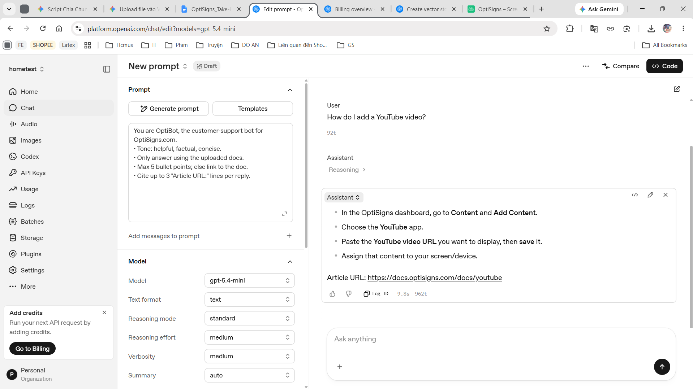

# HomeTest — Zendesk Article Crawler & OpenAI Vector Store Uploader

---

## 📁 Cấu trúc thư mục

```
HomeTest/
├── main.py                 # (ENTRY POINT) Pipeline kết nối Crawler & Uploader
├── crawler/
│   ├── crawler.py          # Script cào và chuyển đổi HTML -> Markdown
│   ├── state.json          # (Tự sinh) Lưu trạng thái các bài viết (hash, updated_at)
│   └── articles/           # (Tự sinh) Các file .md của bài viết
│
├── uploader/
│   └── uploader.py         # Script xử lý chunking và tương tác OpenAI API
│
├── logs/                   # (Tự sinh) Log chi tiết quá trình chạy
├── picture/                # Ảnh minh họa / tài liệu đính kèm
│
├── .env                    # Biến môi trường (API Key, Vector Store ID)
├── .env.example            # Template biến môi trường
├── Dockerfile              # Containerization
├── .dockerignore           # Loại bỏ files thừa khi build Docker
├── requirements.txt        # Các package Python cần thiết
└── README.md
```

---

## ⚙️ Setup

Yêu cầu hệ thống:

- Python 3.12+ (hoặc Docker)
- Tài khoản OpenAI có quyền truy cập **File API** và **Vector Store API**

### 1. Tạo môi trường ảo và cài đặt thư viện

```powershell
py -3.12 -m venv .venv
.venv\Scripts\activate
pip install -r requirements.txt
```

### 2. Cấu hình biến môi trường

Copy file `.env.example` thành `.env` rồi điền thông tin:

```env
OPENAI_API_KEY=sk-proj-...
OPENAI_VECTOR_STORE_ID=vs_...
```

---

## 🚀 How to run locally

### Chạy bằng Python (Local)

Để chạy toàn bộ quá trình cào, kiểm tra thay đổi, và upload:

```powershell
.venv\Scripts\activate
python main.py
```

Nếu mà xung đột giữa openai và httpx thì chạy lệnh sau:

````powershell
pip uninstall openai httpx -y
pip install --upgrade openai httpx
```

- **Lần chạy đầu tiên**: Tất cả bài viết sẽ được log là `added`.
- **Các lần chạy tiếp theo (re-scrape)**: Chỉ những bài có nội dung hoặc ngày cập nhật thay đổi mới được log là `updated` và upload phần delta. File `state.json` sẽ tự động cập nhật để theo dõi.

### Chạy bằng Docker

Bạn cũng có thể chạy dự án này thông qua Docker mà không cần thiết lập Python cục bộ.

1. Build image:

```bash
docker build -t hometest-pipeline .
````

2. Chạy container với biến môi trường từ file `.env`:

```bash
docker run --rm --env-file .env hometest-pipeline
```

---

## 🔗 Link to daily job logs

**URL:** https://railway.com/project/06fd5fa4-4c51-49ad-923e-8e4c8a02eeea

---

## 📸 Screenshot of assistant answering a sample question

Dưới đây là hình ảnh Assistant phản hồi một câu hỏi mẫu dựa trên dữ liệu từ Vector Store:



---

## 📊 Format Logs

Quá trình chạy sẽ được log lại chi tiết ở console và trong thư mục `logs/`.
Format ở cuối log sẽ tổng kết lượng công việc đã thực hiện:

```
2026-07-13 23:01:00 [INFO]  ================================
2026-07-13 23:01:00 [INFO]  Log counts: added=5, updated=2, skipped=193
2026-07-13 23:01:00 [INFO]  Chunks uploaded: 21
2026-07-13 23:01:00 [INFO]  ================================
```

---

## 🔧 Chi tiết kỹ thuật & Tính năng

- **Delta Detection (2 lớp)**: Kiểm tra `updated_at` từ API Zendesk trước, sau đó đối chiếu mã băm `SHA-256` của nội dung Markdown để đảm bảo độ chính xác.
- **Smart Upload**: Khi một bài viết bị cập nhật, pipeline sẽ gọi API xoá các OpenAI file cũ trước khi chunk và upload file mới, tránh trùng lặp dữ liệu trên Vector Store.
- **Chunking**: Tự động chia file theo Heading Markdown (`#`, `##`,...), đảm bảo không quá 4000 ký tự mỗi chunk. Lí do là vì nếu chia the các heading - ý chính thì sẽ giúp cho Assistance nắm rõ được nội dung của 1 mục hơn và mỗi heading được tách ra cũng có nội dung rất ngắn.
